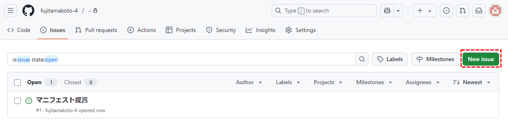

# 課題提起（Issue・イシュー）マニュアル

<h2 id="new_issue">新しいイシューの立て方</h2>

### ①サインイン

[GitHub](https://github.com/)にサインインします。 アカウントを持っていない場合はアカウントを作成します。

### ②Issuesにアクセス

[https://github.com/fujitamakoto-4/-/issues](https://github.com/fujitamakoto-4/-/issues) にアクセスします。  

### ③Issueの立ち上げ（作成画面）

**New Issue**をクリックして、Issue（議論したいこと）を作成します。

<h2 id="comment_issue">イシューへのコメント</h2>

### ④コメントを作成

テンプレートに沿って、コメントを作成します。  
**提出後も内容を編集することができます。Preview**タブをクリックすると提出した際の見え方を確認することができます。  

## ⑤コメント提出

コメントを作成したら**Submit new issue**をクリックします。  

## ⑥提出完了

コメントした内容がGitHub上に反映されます。
